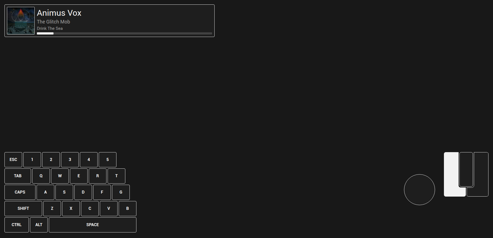

A Browser Overlay for OBS (Linux)
===
A collection of Vue-based input and media widgets, to be used in an OBS Browser source

## Dependencies

This system requires:
- Node.js (22+)
- [input-overlay](https://github.com/univrsal/input-overlay) (with WebSocket server enabled)
- An MPRIS-compatible media player (defaults to Audacious)

## Quick Start

- Install all dependencies for `obs-keyboard` (`npm install`)
- Install all dependencies for `obs-mpris-server` (`npm install`) (optional)
- Start dev server for `obs-keyboard` (`npm run dev`)
- Start `obs-mpris-server` (`npm run start`) (optional)
- Create a browser source in OBS, and point it to location of `obs-keyboard`
  
## Additional Info
For the server:
- MPRIS source can be set by passing `-- -m <dbus-media-player-name>` on startup
  - Only the last part of the name is needed (omit `org.mpris.MediaPlayer2`)
- The MPRIS server only needs to be started if you're using the media player widget
- Media player doesn't need to be running before server, but the server currently can't listen to any media player other than the one set at launch
- If multiple instances of a media player are open, the server needs to be set to listen to a specific instance before it will receive data

For the front-end:
- Widgets are enabled by URL params (`/?`):
  - `keyboard` to enable keyboard/mouse widget (`=full` for full keyboard)
  - `controller` to enable PS4-esque controller widget
  - `music` to enable music widget
  - `right` to make music and controller widgets right-aligned
- In OBS, set the background of the body to transparent to see media sources underneath the overlay 
  - Custom CSS -> `body { background: transparent; }`
